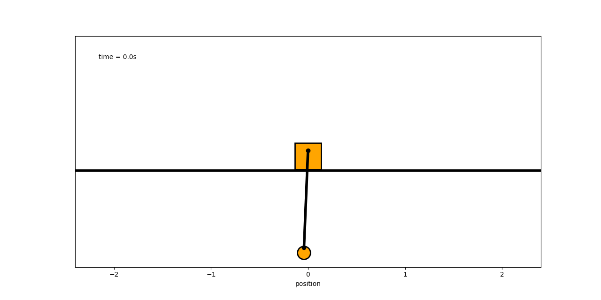

# Inverted Pendulum

    

Swing-up using energy pumping method

$$
    f(t) = (E_p(t) - E_t(t))\dot\theta\cos(\theta)
$$

Where

$$
    E_p(t) = m_pgl_p\cos(\theta) ~~ and ~~ E_t(t) = m_pgl_p
$$

    

